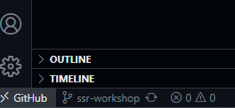
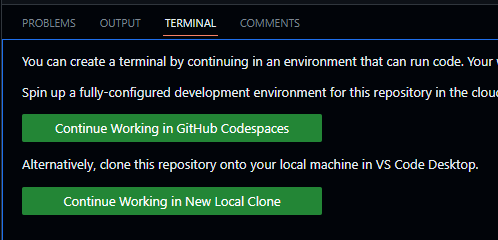
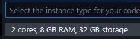

# Server-side rendering workshop

Slides are available at: http://bit.ly/at-ssr-workshop

## How to create your own cloud environment (GitHub Codespace) for this workshop?
- Go to https://github.dev/alcfeoh/ngx-training/tree/ssr-workshop
- Then open the terminal view by clicking on the 'problems' panel in the bottom-left corner:

- Then click on "Continue working in GitHub Codespaces":

- This will fork the project into your own GitHub Codespace. Select the kind of virtual machine you want (the first option is fine):

- Run `npm install` in the terminal. You're all set!

## Running it locally
- You can clone this repository locally if you want. Then run `npm install`.

## List of commands used in this project

- `npm run build`: Compiles our code and outputs it in the `dist` folder. This is a default Angular CLI command.
- `npm run serve-build-static`: Runs a basic static HTTP server using the code built in the `dist` folder. This is a custom command to run our code without a Node.js backend server.
- `npm run serve:ssr:ngx-training`: Runs the Node.js server built by Angular SSR. This commands gets added by the Angular SSR CLI schematics (`ng add @angular/ssr`).
